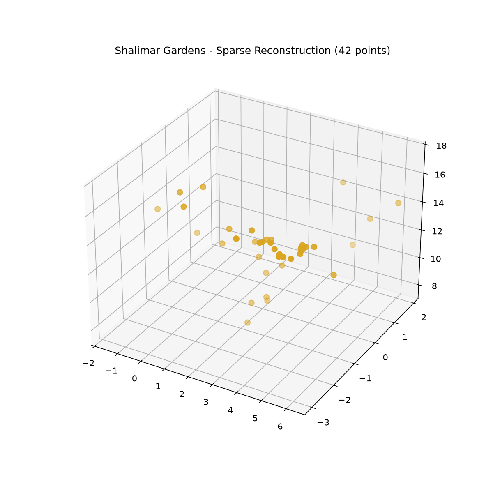
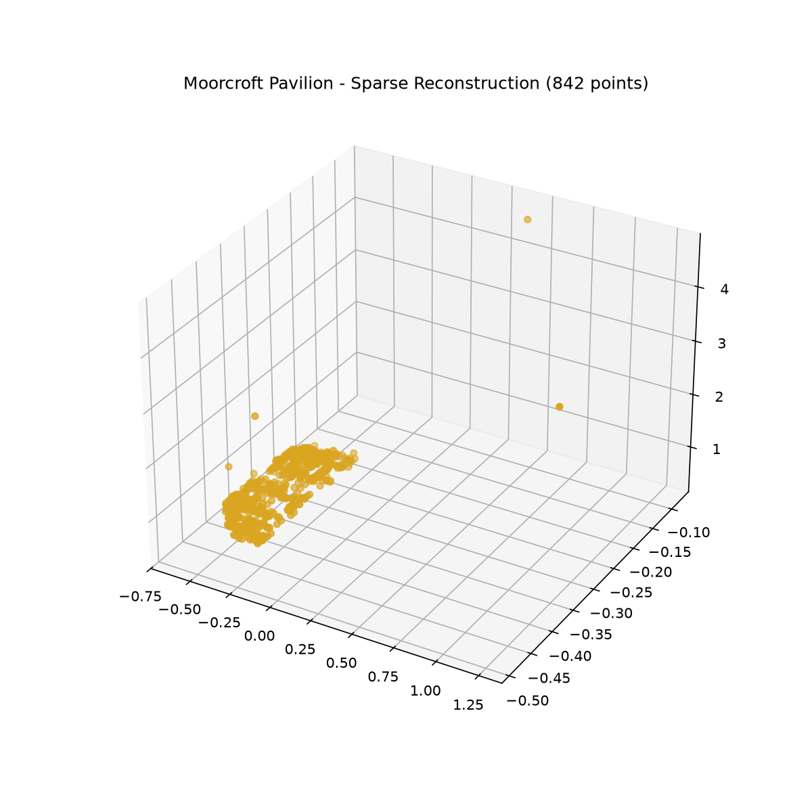

# Shalimar Gardens - 3D Reconstruction

COLMAP-based Structure-from-Motion pipeline for Shalimar Gardens, Lahore, built as part of the PMW × TechRealm heritage preservation internship (Team Charbagh Collective).

## Results

**V1:** 43 general Wikimedia Commons images → 2/43 registered → 42 sparse 3D points
**V2:** 15 tightly-overlapping images of the Moorcroft Pavilion → 15/15 registered (100%) → 842 sparse 3D points (20x improvement)

Dense reconstruction (patch-match stereo) requires a CUDA GPU, unavailable on the local machine used — sparse point clouds are the final deliverable for this run.

## Visual Comparison — V1 vs V2

| V1 (2/15 cameras, 42 points) | V2 (15/15 cameras, 842 points) |
|---|---|
|  |  |

The V2 run shows dramatically denser, more coherent geometry of the Moorcroft Pavilion, confirming the improved image overlap resolved the registration failures seen in V1.

## Files
- `shalimar_gardens_reconstruction.ply` / `_v2.ply` — sparse point cloud outputs
- `run_reconstruction.py` / `_v2.py` — pipeline scripts
- `download_images.py` / `_v2.py` — image curation scripts
- `point_cloud_screenshot.png` / `_v2_screenshot.png` — visualizations
